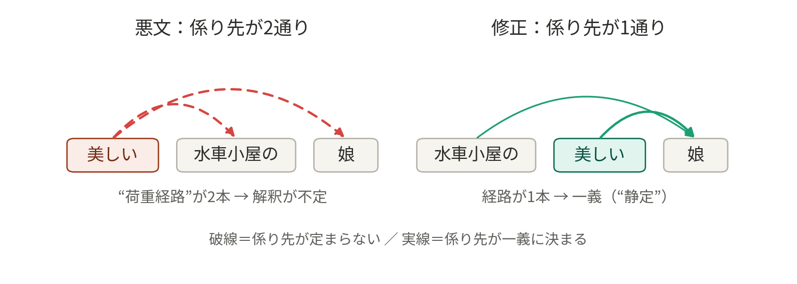
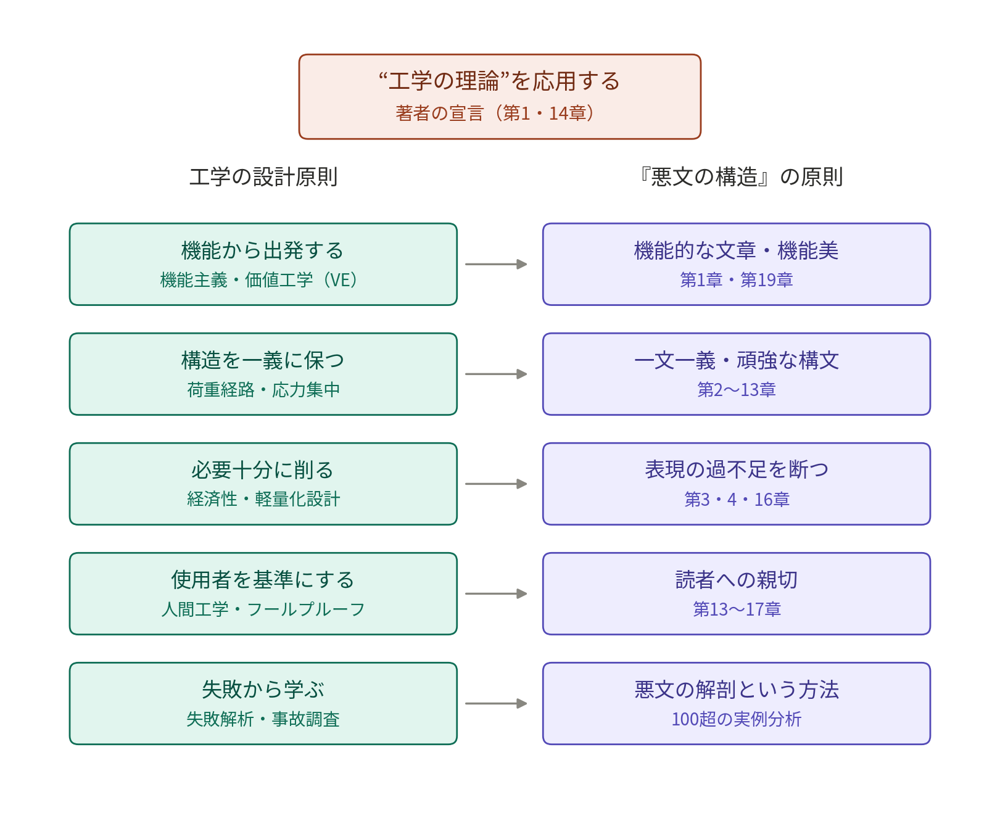

# 『悪文の構造』と工学の原則――千早耿一郎は何を応用したのか

千早耿一郎『悪文の構造――機能的な文章とは』（ちくま学芸文庫）を読んでいます。本書は1979年の初版刊行時から、工学の理論を文章術に応用すると宣言していた、異色の文章読本です。

ここで、二つの問いが立ちます。第一に、著者が参照した「工学の理論」とは、具体的に何だったのか。第二に、そもそも工学の根幹を成す原則とは何か。この二つを、一次資料と英日の工学文献にあたって整理しました。なお本書からの引用は、本書の抜粋を豊富に掲載している KAZE 氏の note 記事と、各種の書評に依拠しています。文庫版本文での最終確認は、今後の課題です。

先に結論を述べます。工学の根幹を成すのは、設計（design）の営みです。すなわち、目的（機能）を、資源と知識の制約の下で、不確実性と使用者の誤りを織り込みながら、失敗事例から学んだ知識によって、確実に働く構造として実現すること。『悪文の構造』は、この設計思想を「文」という人工物に移植した本だと読めます。

## 1. 本書は自ら「工学の理論」の応用を宣言している

まず、書誌を確認します。『悪文の構造――機能的な文章とは…』は、千早耿一郎の著書として、1979年11月に木耳社から刊行されました（木耳選書）。1988年7月には、新装版が出ています。2024年10月にはちくま学芸文庫に収められ、石黒圭による解説「「悪文」に名著が多い理由」が付されました。

本書と工学との関係は、解釈の産物ではありません。著者自身の宣言です。第1章に、こうあります。「洗練された、機能的な文章とは、なにか。わたくしは、ここで工学の理論を応用したいと思う」。第14章でも著者は、機能的な文章を追求するために用意した道具は「工学の理論」だった、と総括しています。

複数の書評も、冒頭で工学のコンセプトを列挙する点を、本書の特色として挙げています。書評によれば、機能的な文章の条件は次の五つです。

- 意味が確実に取れること
- 曖昧でないこと
- 誤解を生まないこと
- 読み手に手間を取らせないこと
- 読み手への親切心があること

対する悪文は、次の七つの特徴で規定されます。

- 主語と述語の対応の悪さ
- 修飾関係の悪さ
- 語の選択の悪さ
- 句読点の悪さ
- 文脈の混同
- 無用の表現
- バランスの悪さ

注目すべきは、著者の経歴です。千早耿一郎（1922–2010）は、第一神戸商業学校を卒業後、日本銀行に入行しました。戦後に復帰し、吉田満らと文芸活動に従事します。著書には詩集や小説、伝記のほか、文章論・事務管理論があります。つまり著者は、職業技術者ではありません。中央銀行の実務家であり、詩人です。

それでは、「工学の理論」はどこから来たのでしょうか。経歴からもっとも整合的なのは、次の二つの経路です。第一の経路は、戦後日本の事務管理論です。テイラーの科学的管理法（1911）を、レフィングウェル（1917）が事務作業に展開しました。この系譜は日本で、帳票設計・規程文書・事務標準化の実務として定着します。いわば、経営工学です。第二の経路は、当時の機能主義という時代精神です。時代背景も、この見方を補強します。国語学者の樺島忠夫は、『文章工学――表現の科学』（三省堂新書、1967）、『続文章工学』（1968）、『新文章工学』（1978）を出していました。「文章を工学する」という語彙は、本書刊行の直前、すでに日本で流通していたのです。

石黒圭の解説は、本書の設計思想を一言で要約しています。本書の主張は、文の構造が一つの意味でしか解釈できないよう「頑強」に書くことに尽きる、と。石黒によれば、本書はそのための必要条件を残らず挙げて論じた本です。そして著者は、銀行生活と文芸生活の両面で、この「一文一義」に文章の機能美を見出しました。

頑強、構造、機能美。語彙そのものが、構造工学と機能主義デザインのものです。章題にも、同じ語彙が並びます。述語は「基幹」（主構造部材）と呼ばれます。並列語は、「合流点」「左右均衡の論理」（節点の釣り合い）として扱われます。「表現の過不足」（必要十分性）が説かれます。そして最終章は、「機能的なものこそ美しい」という機能主義の信条で閉じられます。分析手法も工学的です。文を枝状に分解し、各語の関係を視覚化して、機能性を判定する。構造物の骨組み解析図と、まったく同型の手法です。

## 2. 工学の根幹を成す五つの柱とメタ原則

それでは、著者が汲んだと思われる「工学の理論」の水源を探ります。工学一般の根幹原則を、英日の代表的文献に沿って、五つの柱に整理します。

### 柱1：機能から出発する

建築家サリヴァンは、1896年の論文で「form ever follows function」（形態は機能に従う）と述べました。この一句は、機能主義の標語となります。工学設計論では、GE のマイルズが創始した価値工学（VE）が、この発想を手続きに定式化しました（著書 Techniques of Value Analysis and Engineering, 1961）。部品の機能を動詞＋名詞で定義し、同じ機能を最小コストで満たす代替案を探す、という手続きです。VE は1960年代に日本の製造業へ本格導入され、事務部門の改善にも波及しました。ドイツ設計工学の教科書 Pahl & Beitz『Konstruktionslehre』（1977、本書と同時代）も、要求リストから機能構造（Funktionsstruktur）を分解することを、設計の出発点に置きます。

文章側の対応は明白です。文の機能を「伝達」と定義し、その機能を果たさない語を、無用の表現として切り捨てる。これは、本書の骨格そのものです。

### 柱2：構造を一義に保つ

第二の柱は、構造の一義性です。力の流れ（荷重経路）を曖昧にしない、と言い換えられます。構造力学では、静定構造なら、外力に対する各部材の力が一意に決まります。設計者は、力の伝わる経路を完全に追跡できます。逆に、経路が不明瞭な設計は危険です。開口部の角に生じる応力集中は、デハビランド・コメット機（1954）の疲労破壊事故の教訓として知られます。J.E. Gordon『Structures』（1978）は、この直観を一般読者向けに解説した古典です。

本書の中心命題「一義的に解釈できる頑強な文」は、この荷重経路の一意性を、意味の伝達経路に写像したものと読めます。係り受けの曖昧さが「構造の不定」にどう対応するか、古典的な例文で図にしました。

*図1：「美しい水車小屋の娘」の係り先は二通りに割れる（構造不定）。語順を変えれば一通りに定まる。*

図1が示すのは、本書の中心にある「構造の不定」の問題です。「美しい水車小屋の娘」では、「美しい」が「水車小屋」と「娘」のどちらに係るのか、構文だけからは決定できません。力学の言葉でいえば、外力（読者の解釈）に対して部材力（意味）が一意に定まらない、不静定な構造です。

本書の処方は、工学的です。第一の処方は、語順を変えて、係る語と係られる語を隣接させることです（「水車小屋の美しい娘」）。第二の処方は、それができないとき、読点で切れ目を明示することです。第13章「切れ目を示せ――読者のための句読点――」は、この処方を「原則の第一」から「原則の第八」まで体系化しています。係る語と係られる語が近いときは、間に読点を打たない。隔たっているときは、係る語の直後に打つ。距離に応じて、規則を切り替えるのです。部材同士を近づけて接合を明確にするか、それが無理なら明示的な標識を入れるか。構造設計の発想そのものです。

### 柱3：必要十分に削る――ただし有用な冗長は残す

第三の柱は、必要十分、すなわち経済性の原理です。鉄道技師ウェリントンは、『The Economic Theory of the Location of Railways』（1887）の序文で、工学を定義しました。下手な者が2ドルかけてやることを、1ドルでうまくやる技術だ、と。文章術の側にも、同じ思想があります。Strunk『The Elements of Style』（1918）は、「不要な語を削れ」の理由を機械の直喩で説明しました。図面に不要な線がなく、機械に不要な部品がないのと同じだ、というのです。飛行士でもあったサン＝テグジュペリは、『Terre des hommes』（1939）で航空機設計についてこう述べています。完成とは、付け加えるものがなくなったときではなく、取り去るものがなくなったときだ、と。本書の第3・4章「長文は悪文」「短いことはいいことだ」と、第16章「表現の過不足」は、この系譜に連なります。

ただし、注意すべき点があります。本書も工学も、単純な最小化を説いていません。第16章は、過剰な表現を有害とする一方で、表現の不足もまた読者に迷惑をかける、と明言します。公差設計と同じ、両側からの最適化です（公差は、きつすぎればコスト増を、緩すぎれば機能不全を招きます）。さらに第18章は、「遊び」やリズムが感化の働きを通じて、かえって伝達を助けると述べます。工学は、安全率や多重系という意図的な冗長を持ちます。Shannon（1948）は、言語の冗長性を、雑音下の誤り訂正資源として定式化しました。本書の「遊び」は、これらときれいに平行します。「遊び」がハンドルの遊びのように機械設計の術語でもあることは、偶然にせよ示唆的です。

### 柱4：使用者を基準にする

第四の柱は、使用者を基準にすることです。人間工学とフールプルーフの思想であり、著者の職業的な足場にもっとも近い柱だと考えられます。テイラーの科学的管理法（1911）を、レフィングウェルが事務作業に移植しました（『Scientific Office Management』1917）。この系譜は戦後日本で、帳票設計・規程文書・事務標準化の実務として、銀行や官庁に定着します。千早は、日銀の実務家であり、事務管理論の著書を持ちます。読み手の注意力に頼らず、様式の側で誤りを封じる。この発想は、著者にとって日常の技術だったはずです。

同じ思想は、製造現場では新郷重夫のポカヨケ（1960年代）として結晶します。作業者を訓練するのではなく、誤りが物理的に起こりえない構造にする、という考え方です。本書が第1章で掲げる「誤解を生まない文」とは、読者の善意の注意力に期待せず、構文の側で誤読を封じる文です。いわば、文のポカヨケです。第14章から第17章は、「読者に対する親切心」を軸に編成されています。第15章は、イエスかノーか判然としない文を、不親切と断じます。これも、インタフェース設計の発想です。

なお、英語圏では Kapp『The Presentation of Technical Information』（1948）が、機能的英語を提唱しました。木下是雄『理科系の作文技術』（1981）が、これを日本に紹介します。千早の1979年は、これに2年先行しています。独立の到達と見るべきです。後年、この原則は工学文書の規格にまで制度化されます。航空機整備マニュアルの ASD-STE100（一語一義・短文・承認語彙）や、JIS Z 8301 の一義性要求が、その例です。

### 柱5：失敗から学ぶ

第五の柱は、失敗から学ぶことです。Petroski は、『To Engineer is Human』（1985）でこう論じました。成功した設計からは、学べることが少ない。工学知識の実質は、失敗の解析から蓄積される、と。Petroski はのちに、この思想を form follows failure（形態は失敗に従う）と定式化します（『The Evolution of Useful Things』1992）。典型例は、タコマナローズ橋の崩落（1940）です。この事故は、フラッター解析を橋梁設計の必須項目に変えました。日本では、畑村洋太郎『失敗学のすすめ』（2000）が、同じ思想を体系化しています。

本書の方法論は、まさにこれです。本書は、名文を鑑賞しません。新聞や公用文から採取した、100を超える悪文標本を枝状に解剖します。そして、破壊のメカニズム（係り受けの不定、合流点の混乱、「が」の濫用）を同定し、規則を抽出します。事故調査報告書の、文章版です。岩淵悦太郎編『悪文』（1961）に始まる日本の悪文本の系譜自体が、この失敗事例集アプローチの伝統だといえます。

石黒圭は解説で、悪文は客観的に定義しやすいが名文は主観的だ、という非対称を指摘しています。これは、工学における失敗と成功の非対称と同型です。崩壊は、一義的に定義できます。しかし成功は、程度問題です。書評にある「悪文を語る本に外れなし」という経験則も、この非対称の帰結でしょう。

### メタ原則：制約下のヒューリスティクス

最後に、五本の柱を束ねるメタ原則を挙げます。制約下のヒューリスティクスです。Simon『The Sciences of the Artificial』（1969）は、設計とは最適化ではなく、限定合理性の下での満足化（satisficing）だと論じました。Koen『Discussion of the Method』（2003、原型は1985）は、工学的方法を次のように定義します。資源の制約下で、よく分かっていない状況に最善の変化を起こすための、ヒューリスティクスの使用である、と。Vincenti『What Engineers Know and How They Know It』（1990）も、工学知識が応用科学ではなく、独自の設計知識であることを示しました。日本では、吉川弘之の一般設計学が、まさに同時代の1979年前後に構想されています。

本書の規則の書き方は、この意味で徹底して工学的です。読点の八原則は、すべて「〜方がよい」「〜のがよい」という勧告形で述べられます。定理ではなく、例外を許す設計規則として提示されるのです。しかも原則の第八は、原則間の優先順位まで与えます。大きな切れ目を示す読点は、欠かせない。小さな切れ目のものは、省略してよい。読点は、打ちすぎれば可読性が落ちる有限資源です。その資源を重要度順に配分せよ、という意思決定規則です。第19章は、機能性と書き手の個性は矛盾しない、と結びます。満足化が設計自由度を残す、という Simon の議論と響き合う結論です。

## 3. 対応の全体像

以上の対応を、一枚にまとめたのが図2です。

*図2：工学の設計原則（左）と『悪文の構造』の原則（右）の対応。*

文献情報とあわせて、表にすると次のとおりです。

| 工学の原則 | 代表文献（初出年） | 工学側の具体例 | 『悪文の構造』での対応 |
|---|---|---|---|
| 機能から出発する | Sullivan (1896)、Miles『Techniques of Value Analysis and Engineering』(1961)、Pahl & Beitz『Konstruktionslehre』(1977) | VE の「動詞＋名詞」による機能定義、要求リスト→機能構造 | 第1章の五条件（機能的な文章とは）、第19章「機能的なものこそ美しい」 |
| 構造を一義に保つ | J.E. Gordon『Structures』(1978) | 静定構造の荷重経路、コメット機の応力集中 (1954) | 一文一義・「頑強な文」、第5〜10章（主格・基幹・修飾・合流点・左右均衡） |
| 必要十分に削る（有用な冗長は残す） | Wellington (1887)、Strunk (1918)、Saint-Exupéry (1939)、Shannon (1948) | 軽量化と安全率・多重系の両立、公差の両側最適化、冗長符号 | 第3・4章（長文は悪文）、第16章（表現の過不足）、第18章（遊び・リズム） |
| 使用者を基準にする | Taylor (1911)、Leffingwell (1917)、新郷重夫のポカヨケ（1960年代）、Kapp (1948) | 帳票標準化、ポカヨケ、後年の ASD-STE100・JIS Z 8301 | 第13章「読者のための句読点」八原則、第14〜17章（読者への親切心） |
| 失敗から学ぶ | Petroski (1985)、畑村洋太郎 (2000) | タコマナローズ橋 (1940)、事故調査に基づく設計改訂 | 100 超の悪文標本の解剖という方法論、悪文本の系譜（岩淵編 1961〜） |
| メタ：制約下のヒューリスティクス | Simon (1969)、Koen (1985/2003)、Vincenti (1990)、吉川弘之 (1979 頃) | 満足化、勧告形の設計規則と例外運用 | 「原則の第一〜第八」の勧告形、第八原則による優先順位付け、第19章（機能性と個性の両立） |

## 4. どこまでが実証で、どこからが再構成か

最後に、エビデンスの層を明示しておきます。因果関係を、過度に主張しないためです。

第一層は、一次資料で確定できる事実です。次の各点は、本文と解説から直接確認できます。著者が「工学の理論」の応用を第1章で宣言し、第14章で総括していること。機能的文章の五条件。「基幹」「合流点」「左右均衡」「機能的なものこそ美しい」という章題の語彙。文を枝状に分解する図解手法。読点の八原則。そして、石黒解説の「一義的に解釈できる頑強な文」という要約です。

第二層は、経歴による傍証です。私の推定は、こうです。「工学」の供給源は、大学工学部の理論ではない。日銀実務家として体得した事務管理論、すなわち科学的管理法の系譜と戦後日本の事務標準化である。加えて、同時代の機能主義である（樺島忠夫の文章工学三部作が、刊行直前に流通していました）。経歴と著書リストからもっとも整合的な仮説ですが、本文での明示的な引用は未確認です。

第三層は、私の再構成です。Sullivan、VE、Gordon、Shannon、Petroski、Simon らとの対応づけが、これにあたります。この対応づけは、思想の同型性の指摘です。千早がこれらの文献を読んだ、という典拠の同定ではありません。とくに Petroski（1985）や畑村（2000）は、刊行が本書より後です。影響関係は、ありえません。同じ原理に独立に到達した、平行進化として読むべきものです。

この推定を検証する決め手は、文庫版の本文そのものにあります。レビューが証言するとおり、第1章には、著者自身が工学のコンセプトを列挙する箇所があります。そこに並ぶ用語の選び方（たとえば「機能」「標準化」「単純化」など）と、あとがき・解説での参考文献への言及を確認すれば、供給源をかなり絞り込めるはずです。事務管理論系なのか、機能主義デザイン論系なのか、あるいは樺島の文章工学なのか。この照合は、次の宿題にします。

## 参考文献

本文で言及した文献を挙げます。洋書は、日本語訳を確認できたものについて、原本と訳書を併記します。

### 本書・関連日本語文献

- 千早耿一郎『悪文の構造――機能的な文章とは』木耳社（木耳選書）、1979年11月。新装版、木耳社、1988年7月。
- 千早耿一郎『悪文の構造――機能的な文章とは』ちくま学芸文庫、筑摩書房、2024年10月（解説：石黒圭「「悪文」に名著が多い理由」）。
- 岩淵悦太郎編『悪文』日本評論社、1961年（第三版1979年。のちに角川ソフィア文庫に収録）。
- 永野賢『悪文の自己診断と治療の実際』至文堂、1969年。
- 中村明『悪文』筑摩書房、1995年（のちにちくま学芸文庫に収録）。
- 樺島忠夫『文章工学――表現の科学』三省堂新書、1967年。
- 樺島忠夫『続文章工学』三省堂新書、1968年。
- 樺島忠夫・佐竹秀雄『新文章工学』三省堂新書、1978年。
- 木下是雄『理科系の作文技術』中公新書、中央公論社、1981年。
- 畑村洋太郎『失敗学のすすめ』講談社、2000年。
- 新郷重夫によるポカヨケ（poka-yoke）の提唱、1960年代（トヨタ生産方式関連文献）。
- 吉川弘之による一般設計学、1979年前後の一連の論考。
- KAZE「千早耿一郎『悪文の構造――機能的な文章とは』」note、2024年10月16日。https://note.com/novalisnova/n/na8649e9d5080

### 洋書（原本・日本語版）

- Louis H. Sullivan, "The Tall Office Building Artistically Considered," *Lippincott's Magazine*, 1896.（"form ever follows function" の出典。日本語版は未確認。）
- Lawrence D. Miles, *Techniques of Value Analysis and Engineering*, McGraw-Hill, 1961.（日本語版は未確認。）
- Gerhard Pahl and Wolfgang Beitz, *Konstruktionslehre*, Springer, 1977.
  - 日本語版：G. パール、W. バイツ、J. フェルトフーゼン、K.H. グローテ著、Ken Wallace 編『エンジニアリングデザイン（第3版）――工学設計の体系的アプローチ』森北出版（英訳第3版 *Engineering Design* からの重訳）。
- J. E. Gordon, *Structures: Or Why Things Don't Fall Down*, Penguin, 1978.
  - 日本語版：J・E・ゴードン著、石川広三訳『構造の世界――なぜ物体は崩れ落ちないでいられるか』丸善、1991年10月。
- Arthur Mellen Wellington, *The Economic Theory of the Location of Railways*, John Wiley & Sons, 1887.（日本語版は未確認。）
- William Strunk Jr., *The Elements of Style*, 私家版、1918年（第1版）。
  - 日本語版（第3版、E. B. White 共著版の訳）：松本安弘・松本アイリン訳『英語文章読本』1979年。荒竹三郎訳『英語文章ルールブック』1985年（いずれも現在は入手困難）。
- Antoine de Saint-Exupéry, *Terre des hommes*, Gallimard, 1939.
  - 日本語版：サン＝テグジュペリ著、堀口大學訳『人間の土地』新潮文庫、新潮社、初版1955年（改版1998年・再改版2012年）。
  - 日本語版（別訳）：サン＝テグジュペリ著、山崎庸一郎訳『人間の大地』（サン＝テグジュペリ・コレクション3）みすず書房、新装版2000年。
  - 日本語版（新訳）：サン＝テグジュペリ著、渋谷豊訳『人間の大地』光文社古典新訳文庫、光文社、2015年。
  - 日本語版（新訳）：サン＝テグジュペリ著、野崎歓訳『夜間飛行・人間の大地』岩波文庫、岩波書店、2025年5月。
- Claude E. Shannon, "A Mathematical Theory of Communication," *Bell System Technical Journal*, vol. 27, 1948.
  - 日本語版：クロード・E・シャノン、ワレン・ウィーバー著、植松友彦訳『通信の数学的理論』ちくま学芸文庫、筑摩書房、2009年8月。
- Frederick Winslow Taylor, *The Principles of Scientific Management*, Harper & Brothers, 1911.
  - 日本語版：F. W. テーラー著、上野陽一訳・編『科学的管理法』産業能率短期大学出版部、1969年。
  - 日本語版（新訳）：フレデリック・W・テイラー著、有賀裕子訳『新訳 科学的管理法――マネジメントの原点』ダイヤモンド社、2009年11月。
- William Henry Leffingwell, *Scientific Office Management*, A. W. Shaw Company, 1917.（日本語版は未確認。）
- Reginald O. Kapp, *The Presentation of Technical Information*, Constable, 1948.（日本語版は未確認。）
- Henry Petroski, *To Engineer is Human: The Role of Failure in Successful Design*, St. Martin's Press, 1985.
  - 日本語版：ヘンリー・ペトロスキ著、北村美都穂訳『人はだれでもエンジニア――失敗はいかにして成功のもとになるか』（フェニックスシリーズ）パンローリング。
- Henry Petroski, *The Evolution of Useful Things*, Alfred A. Knopf, 1992.（日本語版は未確認。）
- Herbert A. Simon, *The Sciences of the Artificial*, MIT Press, 1969.
  - 日本語版（初版の訳）：ハーバート・A・サイモン著、倉井武夫・稲葉元吉・矢矧晴一郎訳『システムの科学』ダイヤモンド社、1969年。
  - 日本語版（第3版の訳）：ハーバート・A・サイモン著、稲葉元吉・吉原英樹訳『システムの科学 第3版』パーソナルメディア、1999年。
- Billy Vaughn Koen, *Discussion of the Method: Conducting the Engineer's Approach to Problem Solving*, Oxford University Press, 2003（原型は1985年の論考）。（日本語版は未確認。）
- Walter G. Vincenti, *What Engineers Know and How They Know It: Analytical Studies from Aeronautical History*, Johns Hopkins University Press, 1990.（日本語版は未確認。）

※「日本語版は未確認」とした洋書は、本稿執筆時点で、日本語訳の刊行情報を確認できなかったものです。
